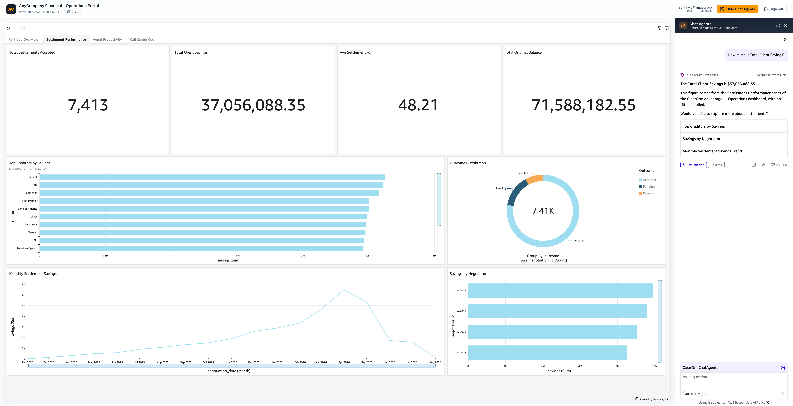

# AnyCompany Financial — AWS Quick Suite Embedded Operations Portal

A reference implementation that embeds an **AWS Quick Suite** (formerly Amazon QuickSight) operational dashboard **and** an interactive **Chat Agent** inside a custom React web application, behind Cognito-mediated OIDC federation.



It was built as a working demo for a debt-relief call-center customer (rebranded here as "AnyCompany Financial") evaluating whether to embed Quick Suite-based reporting and natural-language analytics in their next-generation CRM.

| What | Where |
| --- | --- |
| Live demo (sample deployment) | `https://<your-distribution>.cloudfront.net` |
| Branding | "AnyCompany Financial — Operations Portal" |
| AWS account used during development | *not pinned in this repo — use your own AWS account* |
| Default region | `us-west-2` (also Quick Suite identity region) |

> **Local config:** copy `.env.example` to `.env` and fill in your AWS account ID, Quick Suite admin user, S3 bucket, and (after deploy) the CloudFront / Cognito / API Gateway IDs. Source it before running deploy / data / cleanup scripts: `set -a && source .env && set +a`. `.env` is gitignored; `.env.example` is committed as the template.

---

## Table of Contents

1. [What this app does](#what-this-app-does)
2. [Architecture at a glance](#architecture-at-a-glance)
3. [Prerequisites](#prerequisites)
4. [One-time AWS setup](#one-time-aws-setup)
5. [Deploy from scratch](#deploy-from-scratch)
6. [Day-2 operations](#day-2-operations)
7. [Using the portal](#using-the-portal)
8. [Configuration reference](#configuration-reference)
9. [Troubleshooting](#troubleshooting)
10. [Cleanup](#cleanup)
11. [Security notes](#security-notes)
12. [License](#license)

---

## What this app does

The portal authenticates a user with **Amazon Cognito**, exchanges the resulting OIDC ID token via STS for short-lived AWS credentials, and uses those credentials to ask **Amazon Quick Suite** to mint embed URLs that the browser loads inside iframes.

Two experiences are wired up in a single SPA:

1. **Operations Dashboard** — a multi-sheet Quick Suite dashboard showing portfolio, settlement performance, agent productivity, and call-center KPIs. Always full-width.
2. **Chat Agents** — a Quick Suite **QuickChat** experience embedded in a sliding right-side drawer. Lets users ask natural-language questions about the same datasets backing the dashboard. The agent is locked to a specific `fixedAgentId` so the dropdown opens on the right assistant.

Both experiences share the same Cognito sign-in, are served behind CloudFront with WAF + a private S3 origin, and produce no static credentials in the browser at any point.

---

## Architecture at a glance

```
                     ┌────────────────────────────────────────┐
                     │           Browser (Vite/React SPA)     │
                     │                                        │
                     │  ┌──────────────────────────────────┐  │
   1. visit          │  │  Cognito OAuth code flow         │  │
   2. redirect ─────▶│  └────────────────┬─────────────────┘  │
                     │                   │ id_token           │
                     │                   ▼                    │
                     │  ┌──────────────────────────────────┐  │
                     │  │  embedDashboard() embedQuickChat │  │
                     │  │  (Quick Suite Embedding SDK)     │  │
                     │  └────┬─────────────────────────────┘  │
                     └───────┼────────────────────────────────┘
                             │ Bearer id_token
                             ▼
   ┌────────────────────────────────────────────────────────┐
   │  CloudFront  ─►  S3 (private, OAC)            (static) │
   │       │                                                │
   │       └─►  API Gateway (REGIONAL, WAF rate limit)      │
   │              │                                         │
   │              ▼                                         │
   │           Lambda  (embed_oidc_federation.py)           │
   │              │  ┌────────────────────────────────────┐ │
   │              │  │ verify_and_decode_jwt(id_token)    │ │
   │              │  │   ↳ JWKS cached, RS256             │ │
   │              │  │ assume_role_with_web_identity      │ │
   │              │  │   ↳ STS short-lived creds          │ │
   │              │  │ qs.generate_embed_url_for_         │ │
   │              │  │      registered_user(...)          │ │
   │              │  └────────────────────────────────────┘ │
   │              ▼                                         │
   │           Amazon Quick Suite (us-west-2)               │
   │           ├ Dashboard: clearone-operations-dashboard   │
   │           ├ Datasets:  5 SPICE imports from S3         │
   │           └ Chat agent: shared with federated user     │
   └────────────────────────────────────────────────────────┘
```

**Key design decisions**

- **Federated user model.** A single IAM role (`clearone-quicksuite-web-identity-role`) trusts the Cognito User Pool as an OIDC IdP. Each Cognito user becomes a Quick Suite "registered user" whose `UserName` is `<role-name>/<email-local-part>`. Permissions on dashboards and chat agents are granted directly to that QS user ARN.
- **No anonymous embedding.** Every embed URL is minted *for that specific user*, so dashboard-level row filters and per-user agent sharing apply.
- **Static frontend.** A Vite-built React bundle lives in S3, served via CloudFront. The only dynamic call from the browser is to one Lambda (`/prod/embed-sample`).
- **Lambda owns secret material.** The browser never sees AWS credentials; it only sees the Cognito ID token and the time-boxed embed URLs.

---

## Prerequisites

### Tooling on your laptop

| Tool | Min version | Why |
| --- | --- | --- |
| AWS CLI v2 | 2.15+ | Provisioning, log tailing |
| Node.js | 20.x (LTS) | Vite + CDK |
| npm | 10.x | bundled with Node |
| Python | 3.12 | Local dataset/dashboard scripts (boto3) |
| Docker (or Finch) | any recent | CDK Lambda bundling |
| jq | 1.6+ | `inject-config.sh` |
| AWS CDK | 2.150+ (`npm install -g aws-cdk@latest`) | Stack deploy |

If you only have **Finch** (no Docker Desktop), create a shim so CDK's bundling can find a `docker` binary:

```bash
mkdir -p "$HOME/.local/bin"
cat > "$HOME/.local/bin/docker" <<'SHIM'
#!/bin/bash
exec finch "$@"
SHIM
chmod +x "$HOME/.local/bin/docker"
export PATH="$HOME/.local/bin:$PATH"
finch vm start || true
```

CDK invokes `docker` directly during Lambda bundling, so the shim is required.

### AWS account requirements

- An AWS account with Admin (or equivalent) IAM permissions.
- **Amazon Quick Suite (Enterprise edition)** subscribed in your target region. The default region for this repo is **us-west-2**.
  - Authentication method: **IAM and Quick Suite (`IDENTITY_POOL`)** — required for OIDC federation.
  - SPICE auto-purchase enabled (or manual capacity) — the dashboard datasets need ~80 MB SPICE.
- An IAM user/role with permissions for: CloudFormation, S3, Cognito, API Gateway, WAF v2, Lambda, IAM, CloudFront, CloudWatch Logs, and Quick Suite.
- A mailbox you control — Cognito will email a temporary password to the user you create.

### Quick Suite-specific prerequisites

1. **Quick Suite identity region must match your deploy region.** The Lambda is configured for `us-west-2`. If you change this, update the IAM policy and `quicksightIdentityRegion` context.
2. **You must create the Chat agent yourself** in the Quick Suite console. The agent UUID is then stamped into CDK context and `inject-config.sh`.
3. **"Domains and Embedding" allowlist.** The Lambda passes `AllowedDomains=[CloudFrontURL]` at runtime, which overrides the static console allowlist — but adding the CloudFront domain in the console as well is harmless and useful for ad-hoc testing.

---

## One-time AWS setup

If you already have a working Quick Suite Enterprise account in **us-west-2**, skip to [Deploy](#deploy-from-scratch).

### 1. Subscribe Quick Suite (us-west-2)

```bash
ACCOUNT_ID=$(aws sts get-caller-identity --query Account --output text)

aws quicksight create-account-subscription \
  --aws-account-id "$ACCOUNT_ID" --region us-west-2 \
  --edition ENTERPRISE \
  --authentication-method IAM_AND_QUICKSIGHT \
  --account-name "your-demo" \
  --notification-email "you@example.com" \
  --admin-group '[]'

# Wait until status flips to ACCOUNT_CREATED
aws quicksight describe-account-subscription \
  --aws-account-id "$ACCOUNT_ID" --region us-west-2
```

### 2. Enable SPICE auto-purchase

```bash
aws quicksight update-spice-capacity-configuration \
  --aws-account-id "$ACCOUNT_ID" --region us-west-2 \
  --purchase-mode AUTO_PURCHASE
```

### 3. Allow Quick Suite's service role to read your demo S3 bucket

The default `aws-quicksight-service-role-v0` policy only lists pre-existing buckets. Update `AWSQuickSightS3Policy` to include your data bucket. `data/qs-s3-policy.json` is the policy used during development — adjust the bucket name and apply:

```bash
aws iam create-policy-version \
  --policy-arn arn:aws:iam::$ACCOUNT_ID:policy/service-role/AWSQuickSightS3Policy \
  --policy-document file://data/qs-s3-policy.json \
  --set-as-default
```

---

## Deploy from scratch

The end-to-end flow has seven stages. Each stage is independently re-runnable.

### Stage 1 — Generate synthetic data

```bash
cd data
python3 generate_clearone_data.py        # writes ./output/*.csv
```

Outputs ~36 K rows across `clients`, `negotiations`, `payments`, `agent_performance`, `call_activity`, plus a small `agents` reference table.

### Stage 2 — Upload data + manifests, create Quick Suite datasets

```bash
S3_BUCKET=clearone-demo-data-$ACCOUNT_ID
aws s3 mb s3://$S3_BUCKET --region us-west-2
aws s3 cp output/  s3://$S3_BUCKET/clearone/  --recursive --region us-west-2
aws s3 cp manifests/  s3://$S3_BUCKET/manifests/  --recursive --region us-west-2

# Update DATASOURCES paths in data/create_datasets.py if you changed the bucket
python3 create_datasets.py
```

This creates 5 S3 data sources, then 5 SPICE datasets with proper column types via logical-table `CastColumnTypeOperation` transforms (S3 physical tables can only emit `STRING`).

### Stage 3 — Build the dashboard

```bash
python3 create_dashboard.py
```

Produces `analysis/clearone-operations-analysis` and a published `dashboard/clearone-operations-dashboard` with four sheets: Portfolio Overview, Settlement Performance, Agent Productivity, Call Center Ops.

### Stage 4 — Build the React app

```bash
cd ../my-app
npm install
npm run build         # outputs dist/
```

### Stage 5 — Deploy the AWS infrastructure

```bash
cd ../webapp
npm install
export AWS_REGION=us-west-2 AWS_DEFAULT_REGION=us-west-2 \
       CDK_DEFAULT_REGION=us-west-2 \
       CDK_DEFAULT_ACCOUNT=$ACCOUNT_ID

cdk bootstrap aws://$ACCOUNT_ID/us-west-2

cdk deploy clearone \
  --context portalTitle="AnyCompany Financial - Operations Portal" \
  --context stackName="clearone" \
  --context quicksightIdentityRegion="us-west-2" \
  --context dashboardId="clearone-operations-dashboard" \
  --context chatAgentId="<your-agent-uuid>" \
  --outputs-file cdk-outputs.json
```

The first deploy uploads the placeholder `config.js` because the CloudFront URL isn't known yet. Run `inject-config.sh` and redeploy to wire the real URLs:

```bash
cd ..
./inject-config.sh    # writes my-app/dist/config.js with real CloudFront/API URLs
cd webapp
cdk deploy clearone --context ...same... --outputs-file cdk-outputs.json
```

The stack creates: 2× S3 buckets (frontend + CF logs), CloudFront, API Gateway + WAF, Cognito User Pool + Domain + Client, OIDC provider, Web identity role, Lambda + log group, and supporting IAM roles. Each `cdk deploy` after the first one takes about 3 minutes.

Stack outputs (also saved to `webapp/cdk-outputs.json`):

- `CloudFrontURL` — open this in a browser
- `ApiGatewayURL` — embed Lambda endpoint
- `CognitoUserPoolId`, `CognitoClientId` — for user provisioning
- `WebIdentityRoleArn` — derives the Quick Suite federated user ARN
- `DashboardId` — the dashboard the Lambda will mint embed URLs for

### Stage 6 — Provision your first user

```bash
cd ..
python3 scripts/create_cognito_user.py you@example.com --profile default
python3 scripts/create_quicksuite_user.py you@example.com --profile default
```

Cognito will email a temporary password. The Quick Suite federated user will be created with `IdentityType=IAM`, role `clearone-quicksuite-web-identity-role`, session name = email local part.

### Stage 7 — Share the dashboard + chat agent

```bash
FED_USER_ARN="arn:aws:quicksight:us-west-2:$ACCOUNT_ID:user/default/clearone-quicksuite-web-identity-role/<emailLocalPart>"

aws quicksight update-dashboard-permissions \
  --aws-account-id $ACCOUNT_ID --region us-west-2 \
  --dashboard-id clearone-operations-dashboard \
  --grant-permissions "[{\"Principal\":\"$FED_USER_ARN\",\"Actions\":[\"quicksight:DescribeDashboard\",\"quicksight:ListDashboardVersions\",\"quicksight:QueryDashboard\"]}]"
```

For the **Chat Agent**, share via the **Quick Suite console** (the CLI does not yet expose chat-agent share APIs):

1. Open https://us-west-2.quicksight.aws.amazon.com/sn/account/<your-account-name>/start/agents
2. Click **+ Create agent**, paste a system prompt (sample below), and **set a Name** like `AnyCompanyChatAgent` — leaving it blank causes the embed dropdown to show "Unknown".
3. Click **Share** → add the federated user (`clearone-quicksuite-web-identity-role/<emailLocalPart>`) as Viewer.
4. Copy the agent's UUID from the URL (`?view=<uuid>`) and put it in:
   - `--context chatAgentId=<uuid>` for `cdk deploy`
   - `chatConfig.fixedAgentId` in `inject-config.sh` (already wired in this repo)

#### Sample agent system prompt

```
I want a chat agent that answers operational reporting questions for
debt-relief call-center managers and supervisors at AnyCompany Financial.

It should use knowledge about:
- Client portfolio (enrolled debt, state, status, enrollment source)
- Negotiations (creditor, settlement %, savings, outcome)
- Payments (monthly drafts, status, failure reasons)
- Agent performance (calls, enrollments, settlements, CSAT)
- Call-center queues (service level, wait, handle time, abandonment)

Capabilities:
- Summarize trends (weekly/monthly)
- Compare teams, offices, agents, states, creditors
- Explain what a dashboard visual is showing
- Flag anomalies

Tone: concise, analytical, 2–3 sentences with specific numbers, end with a
follow-up drill-down question.
```

---

## Day-2 operations

### Update the React app only

```bash
cd my-app && npm run build && cd ..
./inject-config.sh
aws s3 sync my-app/dist/ s3://<frontend-bucket>/ --region us-west-2 \
    --exclude "access-logs/*" --delete
aws cloudfront create-invalidation --distribution-id <DIST_ID> --paths "/*"
```

### Update the Lambda or CDK stack

```bash
cd webapp && cdk deploy clearone --context ... && cd ..
```

The stack picks up the latest `lambda/embed_oidc_federation.py` automatically — CDK bundles it inside Docker/Finch.

### Tail Lambda logs

```bash
aws logs tail /aws/lambda/clearone-quickchat-embed-function \
  --region us-west-2 --since 15m --format short --follow
```

---

## Using the portal

1. Open the CloudFront URL.
2. You'll be redirected to the Cognito hosted login. Sign in with the email + temporary password from the Cognito invite email. Set a new password.
3. The **Operations Dashboard** loads full-width. Use the toolbar to export, undo/redo, reset.
4. Click **Chat Agents** in the top-right to slide in the assistant. The dropdown is locked to your `fixedAgentId`.
5. Type questions, e.g.:
   - "What's our total client savings this quarter?"
   - "Top 5 creditors by total settlement savings"
   - "Which negotiations team has the highest settlement %?"
   - "Compare service level by queue last week"
   - "What does the Portfolio Overview sheet show?"

The ↻ icon in the chat header re-mints the embed URL if a session goes stale.

---

## Configuration reference

### CDK context (passed via `--context key=value`)

| Key | Default | Purpose |
| --- | --- | --- |
| `portalTitle` | `AnyCompany Financial - Operations Portal` | SPA header text |
| `stackName` | `clearone` | CloudFormation stack name + resource prefix |
| `quicksightIdentityRegion` | `us-west-2` | Where QS users live |
| `dashboardId` | `clearone-operations-dashboard` | Pre-published dashboard the embed Lambda points at |
| `chatAgentId` | `(empty)` | Lambda appends `&agentId=<uuid>` to chat embed URLs |

### Lambda environment variables (set automatically by CDK)

| Variable | Source |
| --- | --- |
| `COGNITO_CLIENT_ID`, `COGNITO_USER_POOL_ID`, `COGNITO_DOMAIN_URL` | Cognito construct outputs |
| `WEB_IDENTITY_ROLE_ARN` | Role STS assumes after JWT validation |
| `ALLOWED_ORIGIN`, `REDIRECT_URI`, `CLOUDFRONT_DOMAIN` | CloudFront distribution outputs |
| `QUICKSIGHT_IDENTITY_REGION` | Mirrors `--context quicksightIdentityRegion` |
| `DASHBOARD_ID`, `CHAT_AGENT_ID` | Mirrors the corresponding context values |

### Frontend runtime config (`config.js`, generated by `inject-config.sh`)

```js
window.APP_CONFIG = {
  cognitoDomainUrl: '...',
  cognitoClientId: '...',
  apiUrl: '<API_GW_URL>/prod/embed-sample',
  redirectUri: '<CLOUDFRONT_URL>',
  portalTitle: '...',
  chatConfig: {
    fixedAgentId: '<agent-uuid>',
    allowFileAttachments: false,
    showWebSearch: false,
    showBrandAttribution: false,
    showAgentKnowledgeBoundary: true,
    showUsagePolicy: true,
  },
};
```

---

## Troubleshooting

| Symptom | Likely cause | Fix |
| --- | --- | --- |
| `Insufficient SPICE capacity` when creating datasets | New QS account has 0 GB SPICE | `aws quicksight update-spice-capacity-configuration --purchase-mode AUTO_PURCHASE` |
| Dashboard embed shows 403 / "Access denied" | Federated user is not shared on the dashboard | Run the `update-dashboard-permissions` CLI from [Stage 7](#stage-7--share-the-dashboard--chat-agent) |
| Chat shows "Your session has expired. Please refresh…" | The chat agent has not been shared with the federated user, or QuickChat had no agent to load and self-killed the session | Share the agent via the QS console; click the ↻ icon in the sidebar to re-mint the embed URL |
| Chat dropdown shows "Unknown" | The agent has no Name | Edit the agent in the QS console and set a Name |
| `Domain not allowed` inside the iframe | CloudFront URL changed without redeploying | Re-run `cdk deploy` so the Lambda env updates |
| Lambda bundling fails with `command not found: docker` | Docker (or Finch shim) is not on PATH | Install the Finch→docker shim from [Prerequisites](#prerequisites) |
| `your identity region is X` | You called QS APIs from the wrong region | Always use `--region us-west-2` (or whatever you chose) |

---

## Cleanup

```bash
# 1. CDK stack (CloudFront, Cognito, Lambda, S3 frontend bucket)
cd webapp && cdk destroy clearone

# 2. Quick Suite assets
for d in clearone-clients clearone-negotiations clearone-payments \
         clearone-agent-performance clearone-call-activity; do
  aws quicksight delete-data-set --aws-account-id $ACCOUNT_ID --region us-west-2 --data-set-id $d
  aws quicksight delete-data-source --aws-account-id $ACCOUNT_ID --region us-west-2 --data-source-id ${d}-src
done
aws quicksight delete-dashboard --aws-account-id $ACCOUNT_ID --region us-west-2 --dashboard-id clearone-operations-dashboard
aws quicksight delete-analysis --aws-account-id $ACCOUNT_ID --region us-west-2 \
  --analysis-id clearone-operations-analysis --force-delete-without-recovery

# 3. Synthetic data S3 bucket
aws s3 rb s3://<your-data-bucket> --force

# 4. (Optional) Unsubscribe Quick Suite — DESTRUCTIVE; deletes all QS assets in this
#    account across every region.
# aws quicksight update-account-settings --no-termination-protection-enabled ...
# aws quicksight delete-account-subscription ...
```

---

## Security notes

This repo is **a reference implementation**, not a production-grade system.

- WAF rate-limit rule allows 1000 req/min/IP. Tune for your traffic.
- Cognito MFA is **optional**, not required.
- Lambda reserved concurrency = 100. Increase for production bursts.
- The web-identity role grants `quicksight:GenerateEmbedUrlForRegisteredUser` and `ListUsers` only — no other Quick Suite scope.
- The Cognito user pool **does not** allow self-signup; admins must create users.
- The CloudFront distribution uses the default `*.cloudfront.net` certificate. Bring your own ACM cert + custom domain for production.
- `inject-config.sh` writes API URLs into `config.js` served from CloudFront — not secrets, but they reveal your API Gateway endpoint.

Run a real security review before pointing any human-data workload at this stack.

---

## License

MIT-0 (no attribution required). See [LICENSE](LICENSE).
